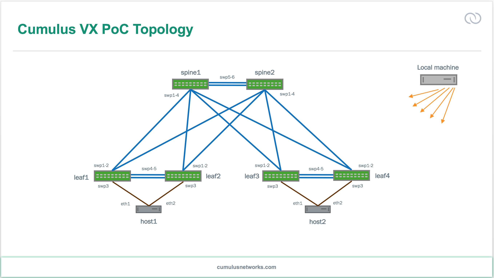

# CumulusVX_Clos

Virtual environment of Cumulus VX using Vagrant, VirtualBox & Ansible.

#### Prerequisites
Please download, install and configure the following prior to proceeding:
  * Download the Cumulus VX version 3.3.1 file for Vagrant Box.
   * https://cumulusnetworks.com/cumulus-vx/download/
  * VirtualBox must be installed.
    * https://www.virtualbox.org/
  * Vagrant (1.8.7) must be installed.
    * https://www.vagrantup.com/
  * Ansible must be installed using PIP or APT.
    * http://www.ansible.com/
  * The Cumulus Linux module for Ansible must be installed.
    * Once Ansible is installed, this is achieved with the command ```ansible-galaxy install cumulus.CumulusLinux```
  * The Cumulux VX Vagrant Plugin must be installed.
    * Once Vagrant is installed, this is achieved with the command ```vagrant plugin install vagrant-cumulus```


#### Setup Instructions
  1. Download and/or install all the above prerequisites.
  2. Add the Cumulus VX Vagrant Box file with the name "cumulus-vx-3.3.1"
   * This is achived with the following command in the directory where the box file is placed:
	``` vagrant box add cumulus-linux-3.3.1-vx-amd64-1495771745.c1063bczfc5ca01.box --name cumulus-vx-3.3.1 ```
  3. Add the Ubuntu Trusty64 Vagrant box file. This add command downloads the box from the public Vagrant Box catalogue:
	* ``` vagrant box add ubuntu/trusty64 ```
  4. If you use git, clone this repo with the command:
	```git clone https://github.com/sutharsan-sivapalan/CumulusVX_Clos.git```.
	Otherwise, download the archive [here](https://github.com/sutharsan-sivapalan/CumulusVX_Clos/archive/master.zip).
  5. Enter the command ```vagrant up``` in the directory where the files were placed. This will create and provision the Cumulus VX instances.
  6. Once completed, connect to the CLI of the VX instances with ```vagrant ssh hostname```.



